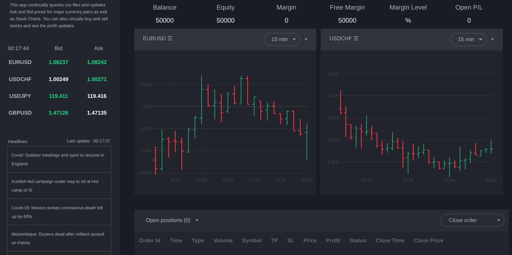

# Crypto-Market-Dashboard

This is a demo crypto market dashboard, where it continually queries local csv files, updates Ask and Bid prices for major currency pairs as well as Stock Charts. You can also virtually buy and sell stocks and see the profit updates, built from [Dash Web Trader Sample](https://github.com/plotly/dash-sample-apps/blob/master/apps/dash-web-trader/)

## Technologies Used

- Built with [Dash interactive Python framework](https://plotly.com/dash/)
- Deployed on [Heroku Cloud Application Platform](https://www.heroku.com/)

## Build Instructions

(The following instructions apply to Windows command line.)

To run this app first clone repository and then open a terminal to the app folder.

```
git clone https://github.com/SaadAAkash/Crypto-Market-Dashboard.git
```

Create and activate a new virtual environment (recommended) by running the following:

On Windows

```
virtualenv venv 
\venv\scripts\activate
```

On Linux

```bash
python3 -m venv myvenv
source myvenv/bin/activate
```

If virtual environment is not installed, install it.
On Linux,

```bash
sudo apt-get install python3-venv
```

Install the requirements:

```
pip install -r requirements.txt
```

Run the app:

```
python app.py
```

If you encounter any error regarding there's no module named Pandas, install them:

```
pip install wheel
pip install pandas
```

Then if you again run the app, the app should be live on your browser at http://127.0.0.1:8050

## Screenshots



## Resources

To learn more about Dash, please visit [documentation](https://plot.ly/dash).
